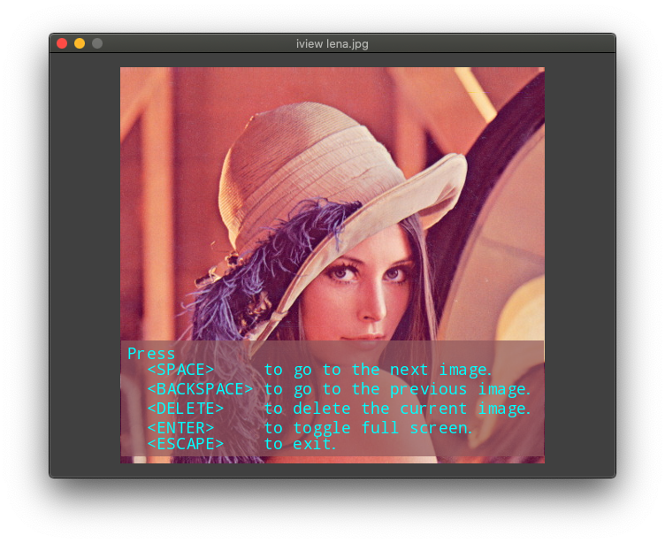

# iview Image Viewer

A command line app for viewing images.

## How it works

## Installation

### Using Pip

```bash
  $ pip install iview  (Not yet available)
```

### Manual

```bash
  $ git clone https://github.com/John-Lee-Cooper/image_viewer
  $ cd image_viewer
  $ python setup.py install
```

## Usage

```bash
$ iview --version
$ iview --help
$ iview -r ~/Pictures
```




### User Interface

 Key        | Result
 :--------: | :------------------------  
 SPACE      | Go to the next image
 BACKSPACE  | Go to the previous image
 DELETE     | Delete the current image
 ENTER      | Toggle full screen
 ESCAPE     | Exit
 other      | Help screen

Holding the left mouse button down and moving the mouse will pan the image.  
Rolling the mouse wheel up and down will zoom out and in where the mouse is.

## Todo

## Written by

John Lee Cooper  
john.lee.cooper@gatech.edu